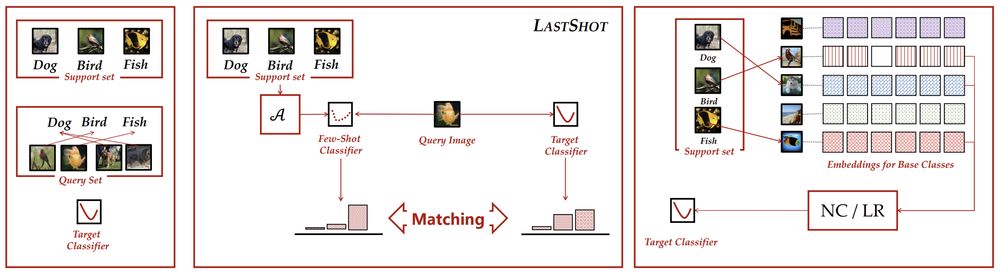

# Few-Shot Learning with a Strong Teacher

This is the repository for "Few-Shot Learning with a Strong Teacher" [[ArXiv]](https://arxiv.org/abs/1812.03664) in PyTorch. If you use any content of this repo for your work, please cite the following bib entry:

    @article{ye2021few,
        author    = {Han-Jia Ye and
                    Lu Ming and
                    De-Chuan Zhan and
                    Wei-Lun Chao},
        title     = {Few-Shot Learning with a Strong Teacher},
        journal   = {CoRR},
        volume    = {abs/2107.00197},
        year      = {2021}
    }

The full commands and checkpoints will be released soon.

## LastShot

Few-shot learning (FSL) aims to train a strong classifier using limited labeled examples. Many existing works take the meta-learning approach, sampling few-shot tasks in turn and optimizing the few-shot learner's performance on classifying the query examples. In this paper, we point out two potential weaknesses of this approach. First, the sampled query examples may not provide sufficient supervision for the few-shot learner. Second, the effectiveness of meta-learning diminishes sharply with increasing shots (i.e., the number of training examples per class). To resolve these issues, we propose a novel objective to directly train the few-shot learner to perform like a strong classifier. Concretely, we associate each sampled few-shot task with a strong classifier, which is learned with ample labeled examples. The strong classifier has a better generalization ability and we use it to supervise the few-shot learner. We present an efficient way to construct the strong classifier, making our proposed objective an easily plug-and-play term to existing meta-learning based FSL methods. We validate our approach in combinations with many representative meta-learning methods. On several benchmark datasets including miniImageNet and tiredImageNet, our approach leads to a notable improvement across a variety of tasks. More importantly, with our approach, meta-learning based FSL methods can consistently outperform non-meta-learning based ones, even in a many-shot setting, greatly strengthening their applicability.

## Standard Few-shot Learning Results

Experimental results on few-shot learning datasets with ResNet-12 backbone (Same as [this repo](https://github.com/kjunelee/MetaOptNet)). We report average results with 10,000 randomly sampled few-shot learning episodes for stablized evaluation.

**MiniImageNet Dataset [Link to Weights]()**
|     Setups     | 1-Shot 5-Way | 5-Shot 5-Way | 10-Shot 5-Way | 20-Shot 5-Way | 30-Shot 5-Way | 50-Shot 5-Way |
|:--------------:|:------------:|:------------:|:-------------:| :------------:| :------------:| :------------:|
|    ProtoNet    |     63.73    |     79.40    |     82.83     |     84.61     |      85.07    |      85.57    |
| +LastShot (NC) |     64.76    |     81.60    |     85.03     |     86.97     |      87.56    |      80.23    |
| +LastShot (LR) |     64.85    |     81.81    |     85.27     |     87.19     |      87.89    |      80.45    |
|      FEAT      |     66.78    |     82.05    |     85.15     |     87.09     |      87.82    |      87.83    |
| +LastShot (NC) |     67.33    |     82.39    |     85.64     |     87.52     |      88.26    |      88.79    |
| +LastShot (LR) |     67.35    |     82.58    |     85.99     |     87.80     |      88.63    |      89.03    |

## Prerequisites

The following packages are required to run the scripts:

- [PyTorch-1.4 and torchvision](https://pytorch.org)

- Package [tensorboardX](https://github.com/lanpa/tensorboardX)

- Dataset: please download the dataset and put images into the folder data/[name of the dataset, miniimagenet or cub]/images

- Pre-trained weights: please download the [pre-trained weights](https://drive.google.com/open?id=14Jn1t9JxH-CxjfWy4JmVpCxkC9cDqqfE) of the encoder if needed. The pre-trained weights can be downloaded in a [zip file](https://drive.google.com/file/d/1XcUZMNTQ-79_2AkNG3E04zh6bDYnPAMY/view?usp=sharing).

## Dataset

### MiniImageNet Dataset

The MiniImageNet dataset is a subset of the ImageNet that includes a total number of 100 classes and 600 examples per class. We follow the [previous setup](https://github.com/twitter/meta-learning-lstm), and use 64 classes as SEEN categories, 16 and 20 as two sets of UNSEEN categories for model validation and evaluation, respectively.

Check [this](https://github.com/Sha-Lab/FEAT/blob/master/data/README.md) for details of data downloading and preprocessing.

## Code Structures
To reproduce our experiments with FEAT, please use **train_fsl.py**. There are four parts in the code.
 - `model`: It contains the main files of the code, including the few-shot learning trainer, the dataloader, the network architectures, and baseline and comparison models.
 - `data`: Images and splits for the data sets.
 - `saves`: The pre-trained weights of different networks.
 - `checkpoints`: To save the trained models.

## Model Training and Evaluation
Please use **train_fsl.py** and follow the instructions below. The file will automatically evaluate the model on the meta-test set with 10,000 tasks after given epochs.

## Arguments
The train_fsl.py takes the following command line options (details are in the `model/utils.py`):

**Task Related Arguments**
- `dataset`: Option for the dataset (`MiniImageNet`, `TieredImageNet`, or `CUB`), default to `MiniImageNet`

- `way`: The number of classes in a few-shot task during meta-training, default to `5`

- `eval_way`: The number of classes in a few-shot task during meta-test, default to `5`

- `shot`: Number of instances in each class in a few-shot task during meta-training, default to `1`

- `eval_shot`: Number of instances in each class in a few-shot task during meta-test, default to `1`

- `query`: Number of instances in each class to evaluate the performance during meta-training, default to `15`

- `eval_query`: Number of instances in each class to evaluate the performance during meta-test, default to `15`

**Optimization Related Arguments**
- `max_epoch`: The maximum number of training epochs, default to `200`

- `episodes_per_epoch`: The number of tasks sampled in each epoch, default to `100`

- `num_eval_episodes`: The number of tasks sampled from the meta-val set to evaluate the performance of the model (note that we fix sampling 10,000 tasks from the meta-test set during final evaluation), default to `200`

- `lr`: Learning rate for the model, default to `0.0001` with pre-trained weights

- `lr_mul`: The learning rate for the top layer (except the encoder) will be multiplied by this value (usually with faster learning rate). Default to `1`

- `lr_scheduler`: The scheduler to set the learning rate (`step`, `multistep`, or `cosine`), default to `cosine`

- `step_size`: The step scheduler to decrease the learning rate. Set it to a single value if choose the `step` scheduler and provide multiple values when choosing the `multistep` scheduler. Default to `100`

- `gamma`: Learning rate ratio for `step` or `multistep` scheduler, default to `0.2`

- `fix_BN`: Set the encoder to the evaluation mode during the meta-training. This parameter is useful when meta-learning with the WRN. Default to `False`

- `augment`: Whether to do data augmentation or not during meta-training, default to `False`

- `mom`: The momentum value for the SGD optimizer, default to `0.9`

- `weight_decay`: The weight_decay value for SGD optimizer, default to `0.0005`

**Model Related Arguments**
- `model_class`: The basic model to use during meta-learning. We provide implementations for baselines (`ProtoNet` and `FEAT`). Default to `FEAT`

- `use_euclidean`: Use the euclidean distance or the cosine similarity to compute pairwise distances. We use the euclidean distance in the paper. Default to `False`

- `backbone_class`: Types of the encoder, i.e., the convolution network (`ConvNet`) or ResNet-12 (`Res12`), default to `Res12`

- `backbone_class_t`: Types of the encoder of the teacher, i.e., the convolution network (`ConvNet`) or ResNet-12 (`Res12`), default to `Res12`

- `balance`: This is the balance weight for the basic loss term in addition to the lastshot loss. Default to `0`

- `kd_temperature`: Temperature over the logits used in the distillation term of LastShot, we #divide# logits with this value. Default to `1`

- `kd_type`: The way to construct a teacher in LastShot, i.e., Nearest Centroid Classifier (`NN`), Logistic Regression (`LR`) or Support Vector Machine (`SVM'). Default to `NN`

- `use_repo`: In which epoch we include the teacher with LastShot. Default to `1`

- `balance_feat`: This is the balance weight for the contrastive regularizer of FEAT. Will not be used when choosing the ProtoNet. Default to `0`

- `temperature`: Temperature over the logits, we #divide# logits with this value. It is useful when meta-learning with pre-trained weights. Default to `64`

- `temperature2`: Temperature over the logits in the regularizer, we divide logits with this value. This is specially designed for the contrastive regularizer of FEAT. Will not be used when choosing the ProtoNet. Default to `1`

- `para_init`: The path of the initialized weights for the backbone. Similarly, `repo_init` denotes the path of the initialized weights for the teacher's backbone.

**Other Arguments** 
- `orig_imsize`: Whether to resize the images before loading the data into the memory. `-1` means we do not resize the images and do not read all images into the memory. Default to `-1`

- `multi_gpu`: Whether to use multiple gpus during meta-training, default to `False`

- `gpu`: The index of GPU to use. Please provide multiple indexes if choose `multi_gpu`. Default to `0`

- `log_interval`: How often to log the meta-training information, default to every `50` tasks

- `eval_interval`: How often to validate the model over the meta-val set, default to every `1` epoch

- `save_dir`: The path to save the learned models, default to `./checkpoints`

Running the command without arguments will train the models with the default hyper-parameter values. Loss changes will be recorded as a tensorboard file.

## Training scripts for LastShot

## Acknowledgment
We thank the following repos providing helpful components/functions in our work.

- [FEAT](https://github.com/Sha-Lab/FEAT)

